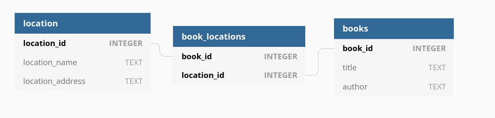

# Making an API rest
## definition
According to wikipedia an “An application programming interface (API) is a connection between computers or between computer programs. It is a type of software interface, offering a service to other pieces of software.”

And REST (representational state transfer) “is a software architectural style that was created to guide the design and development of the architecture for the World Wide Web. REST defines a set of constraints for how the architecture of an Internet-scale distributed hypermedia system, such as the Web, should behave.”

So as it was required to create an API according to the REST architecture, the program should provide a connection between computers or programs using the internet and an “information structure” compatible with the workings of the web.

## technology and available tools
There are many ways to create a software in the C programming language capable of providing web interactivity.  There is the use of sockets to create a connection with another computer in a very low level and highly configurable way. But there are tools and libraries that operate on a “higher” level, and automate some of the more mundane and technical details, which allow us to deal directly with the data being sent or received.

I opted to learn and experiment with the [mongoose](https://mongoose.ws/) library, as it was considerably well documented. It is very easy to use an implement as well, as it has only two files (a single .c source code file and a header).

I experimented with [libcurl](https://curl.se/libcurl/c/) as well, and found it to be a very good option for receiving data from other apis. But as the focus of the challenge was on the server side of the interaction I focused my investigations and energy in using mongoose for all my needs.

## Experiments and development
### HTTP header and methods
Firstly I did a couple of experiments to understand how the [HTTP requests](https://developer.mozilla.org/en-US/docs/Web/HTTP/Messages) and replies work.

There are two parts to a http message, the head and the body.

The head contains information that specifies the method of the request and the path it is made to. As for the body, it contains the actual message being sent.

Mongoose is able to get all these parts on a struct that is generated on each new connection, thus  allowing us to decide how to process the message “body” according to specific needs.

### Ideas for an API
The challenge then was figuring out exactly what my API would do, and how to use that theme as a way to learn the most about API and the REST architecture.

At first I thought about making a kind of “pipe” API, that would get info from another api and filter or transfer it somehow.

But after reading more about the [REST architecture](https://restfulapi.net/rest-api-design-tutorial-with-example/) I decided to create my own database, so that I could design more interesting endpoints and overall data structure.

### Creating the endpoints
I figured a simple “book management” api -- that could relate books to certain locations -- would be simple enough to implement, but at the same time complex enough to have many interesting relations between the data in the database.

So imagine there is a user who wants to figure out which libraries he should go to to find a certain book. For this he should first have a way of figuring out if the desired book is in the system so   then he can look for the places where the book is in. And all these requests should be different paths in the API, so that the information is clearly distinguishable.

for this I figured three tables in a database would suffice:

with these tables we could make the following endpoints

	GET /book
	GET /book/:id
	GET /location
	GET /location:id
	POST /book
	POST /location
	PUT /location/:id/book/:id

So that we can add new data to both tables, read books in relation to places and vice versa. Also it is possible to add a relation between book and place with PUT.

### Ways to use SQL in C

After having the data architecture designed, the actual C implementation was quite straightforward.

As always, there are many ways to implement database functionalities in C. I decided to use SQLite to access and make the database as I had already used it before and thought it would be easier to implement.

After a couple of experiments I had the ability to access a database, make selections and insertions. But the API should send json data to the client, so the next step was to find a way to make this transformation.

### Producing the json format
I found many libraries to make a json output from within a C code. I chose two of them, [cJSON](https://github.com/DaveGamble/cJSON) to make the output to the client, and [mjson](https://github.com/cesanta/mjson) to parse the info sent in the POST requests.

Making an object with cJASON is quite verbose, as it is needed to construct a whole “virtual” object so it can be “printed” as text at the end.

### Mongoose handle and making the routes
Mongoose uses a “handle” function to deal with each individual connection the server receives. In this handle I created a series of “routes” that verify each request, and if valid, leads to a function that reads the database, produces the final jason text, and sends the data back to the client.

### Logging
Each connection gathers data during the execution of the routes and prints it to a .log file.

| IP        | DATE                   | METHOD       | PATH        | PATH CODE | STATUS CODE | DATA SENT IN BYTES |
|-----------|------------------------|--------------|-------------|-----------|-------------|--------------------|
| 127.0.0.1 | [27/Feb/2022:16:56:46] | GET HTTP/1.1 | /location/1 | 4         | 200         | 149                |

the "path code" is used mostly by the CLI tool, so it can verify the requested path

### Unsolved problems
Simultaneous connections is a problem that has not been solved in this project. To handle many requests at the same time it would be required to create a new application -- or something like it -- specifically to handle a queue of database and log access requests.

### Container and docker
A Dockerfile was made so that the application can be containerized. Making a docker image from it guarantees the software will run without any compatibility issues. The use of volumes is recommended to make the database and log files persistent.

## Making the CLI
Making a command line interface for a log reader was an interesting challenge. I began by wondering which interactions could actually help a user desiring to find specific information in the log file.

### Designing a way to filter log lines
A system of filters was made as the core functionality of the CLI. There is the possibility to filter by method and by error code. The program uses a struct to keep all the “flipped” flags and filters after the parsing, and uses this later on to decide which line of the log it is going to actually print to the terminal.

### Formating data to a table
The output is formatted as a table. In case there is no specification of which fields of the log to print, the [libfort](https://github.com/seleznevae/libfort) was used to make a prettier outcome.
